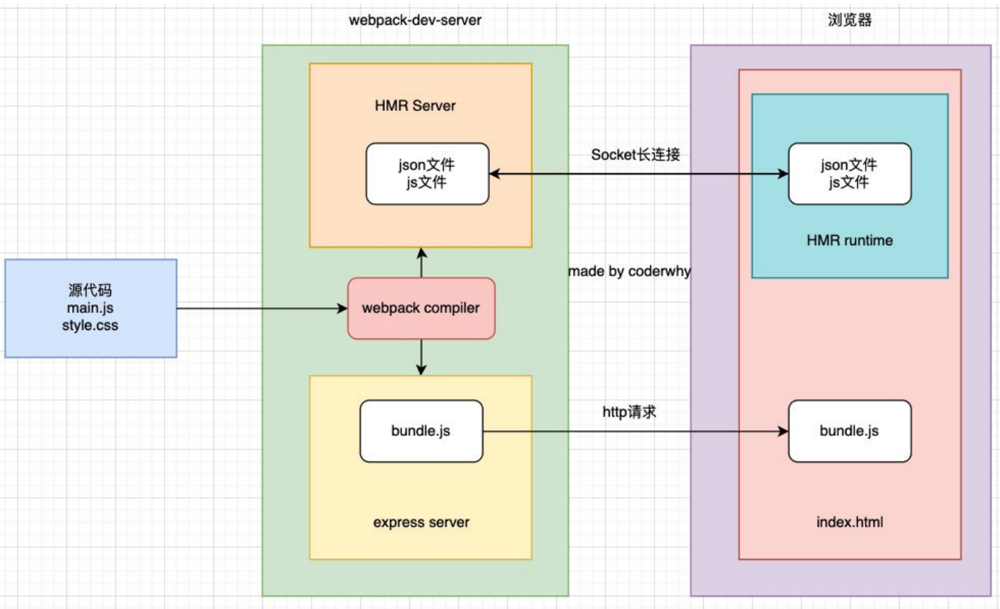

# 4. webpack 开发服务器

## 4.0_webpack 开发服务器-为何学?

文档地址: https://webpack.docschina.org/configuration/dev-server/

抛出问题: 每次修改代码, 都需要重新 yarn build 打包, 才能看到最新的效果, 实际工作中, 打包 yarn build 非常费时 (30s - 60s) 之间

为什么费时?

1. 构建依赖
2. 磁盘读取对应的文件到内存, 才能加载
3. 用对应的 loader 进行处理
4. 将处理完的内容, 输出到磁盘指定目录

解决问题: 起一个开发服务器, 在电脑内存中打包, 缓存一些已经打包过的内容, 只重新打包修改的文件, 最终运行加载在内存中给浏览器使用

## 4.1 Webpack watch 的配置

- webpack 给我们提供了 watch 模式：

  - 在该模式下，webpack 依赖图中的所有文件，只要有一个发生了更新，那么代码将被重新编译；

  - 我们不需要手动去运行 npm run build 指令了；

- 如何开启 watch 呢？两种方式：

  - 方式一：在导出的配置中，添加 watch: true；

  - 方式二：在启动 webpack 的命令中，添加 --watch 的标识；

- 这里我们选择方式二，在 package.json 的 scripts 中添加一个 watch 的脚本：

  - ```json
    "scripts":{
        "build":"webpack --config wk.config.js",
        "watch":"webpack --watch",
        "type-check":"tsc --noEmit",
        "type-check-watch":"npm run type-check --  --watch"
    },
    ```

## ==4.2 webpack-dev-server 自动刷新==

> 目标: 启动本地服务, 可实时更新修改的代码, 打包**变化代码**到内存中, 然后直接提供端口和网页访问

1. 下载包

   ```bash
   yarn add webpack-dev-server -D
   ```

2. 配置自定义命令

   ```js
   scripts: {
   	"build": "webpack",
   	"serve": "webpack serve"
   }
   ```

3. 运行命令-启动 webpack 开发服务器

   ```bash
   yarn serve
   #或者 npm run serve
   ```

> 总结: 以后改了 src 下的资源代码, 就会直接更新到内存打包, 然后反馈到浏览器上了

## 4.3 webpack-dev-server 配置

1. 在 webpack.config.js 中添加服务器配置

   更多配置参考这里: https://webpack.docschina.org/configuration/dev-server/#devserverafter

   ```js
   module.exports = {
     // ...其他配置
     devServer: {
       port: 3000, // 端口号
     },
   }
   ```

## 4.4 什么是模块热替换（HMR）

- 什么是 HMR 呢？

- HMR 的全称是 Hot Module Replacement，翻译为模块热替换；

- 模块热替换是指在 应用程序运行过程中，替换、添加、删除模块，而无需重新刷新整个页面；

- HMR 通过如下几种方式，来提高开发的速度：

  - 不重新加载整个页面，这样可以保留某些应用程序的状态不丢失；
  - 只更新需要变化的内容，节省开发的时间；

  - 修改了 css、js 源代码，会立即在浏览器更新，相当于直接在浏览器的 devtools 中直接修改样式；

- 如何使用 HMR 呢？

  - 默认情况下，webpack-dev-server 已经支持 HMR，我们只需要开启即可；
  - 修改 webpack 的配置文件

  ```js
  devServer:{
      hot:true
  },
  ```

  - 在不开启 HMR 的情况下，当我们修改了源代码之后，整个页面会自动刷新，使用的是 live reloading；

## 4.5 HMR 原理

- 那么 HMR 的原理是什么呢？如何可以做到只更新一个模块中的内容呢？

  - webpack-dev-server 会创建两个服务：提供静态资源的服务（express）和 Socket 服务（net.Socket）；

  - express server 负责直接提供静态资源的服务（打包后的资源直接被浏览器请求和解析）；

- HMR Socket Server，是一个 socket 的长连接：

  - 长连接有一个最好的好处是建立连接后双方可以通信（服务器可以直接发送文件到客户端）；

  - 当服务器监听到对应的模块发生变化时，会生成两个文件.json（manifest 文件）和.js 文件（update chunk）；

  - 通过长连接，可以直接将这两个文件主动发送给客户端（浏览器）；

  - 浏览器拿到两个新的文件后，通过 HMR runtime 机制，加载这两个文件，并且针对修改的模块进行更新；

`原理图:`



`Proxy:`

- proxy 是我们开发中非常常用的一个配置选项，它的目的设置代理来解决跨域访问的问题：

  - 比如我们的一个 api 请求是 '...localhost:8888'，但是本地启动服务器的域名是 '...localhost:8000'，这 个时候发送网络请求就会出现跨域的问题；

  - 那么我们可以将请求先发送到一个代理服务器，代理服务器和 API 服务器没有跨域的问题，就可以解决我们的跨 域问题了；

- 我们可以进行如下的设置：

  - target：表示的是代理到的目标地址，比如 /api-hy/moment 会被代理到 '...localhost:8888/api-hy/moment'；

  - pathRewrite：默认情况下，我们的 /api-hy 也会被写入到 URL 中，如果希望删除，可以使用 pathRewrite；

  - secure：默认情况下不接收转发到 https 的服务器上，如果希望支持，可以设置为 false；

  - changeOrigin：它表示是否更新代理后请求的 headers 中 host 地址；

  `详细代码:`

  ```js
    devServer: {
      contentBase: "./public",
      hot: true,
      host: "0.0.0.0",
      port: 7777,
      open: true,
      // compress: true,
      proxy: {
        "/api": {
          target: "http://localhost:8888",
          pathRewrite: {
            "^/api": ""
          },
          secure: false,
          changeOrigin: true
        }
      }
    },
  ```

`alias配置：`

- 特别是当我们项目的目录结构比较深的时候，或者一个文件的路径可能需要 ../../../这种路径片段；
- 我们可以给某些常见的路径起一个别名；

```js
  resolve: {
    extensions: [".js", ".json", ".mjs", ".vue", ".ts", ".jsx", ".tsx"],
    alias: {
      "@": path.resolve(__dirname, "./src"),
      "js": path.resolve(__dirname, "./src/js")
    }
  },
```
